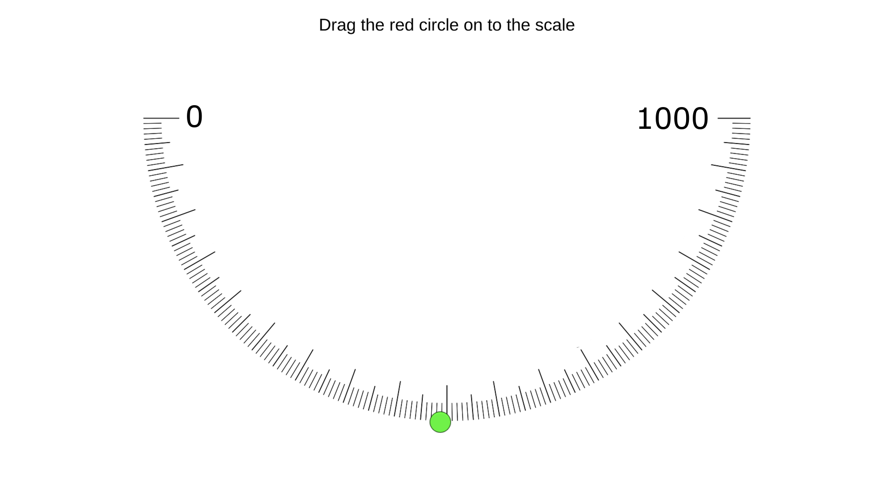

# Time Evaluation UI

The time evaluation tool to use in psychological experiments in Unity.

Try it out [here](https://vagechirkov.github.io/TimeEvaluationUI/).

## Installation

### Import package from GitHub

1. Open the Package Manager in Unity editor: `Window -> Package Manager`

2. In the Package Manager press the `+` button to add a package and select `Add package from git URL...`.

3. Paste the following line in the appeared text field: `https://github.com/vagechirkov/TimeEvaluationUI.git`

4. Press the `Add` button.
